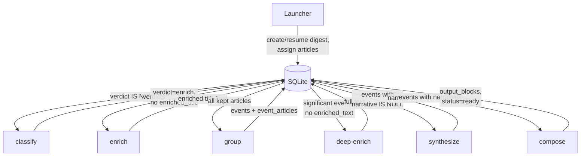

# DB-Centric Recap Pipeline Architecture

## Problem statement

The current pipeline is file-based: each step reads/writes JSON files in a pipeline directory, passes data between steps in memory, and has no persistent state beyond the workdir. This creates several problems:

1. **No resumability.** If the pipeline crashes mid-way, there is no way to resume -- the entire pipeline must be re-run from scratch, re-executing expensive agent calls.
2. **No debug workflow.** To iterate on a single step (e.g., tweak a classify prompt), the developer must re-run all preceding steps every time. There is no mechanism to re-run one step in isolation.
3. **Wasted agent calls.** If the agent succeeds but the pipeline crashes before persisting results, the agent output is lost and must be regenerated (costing time and tokens).
4. **No path to incremental updates.** Adding new articles to an existing digest requires re-processing everything from scratch -- there is no way to classify only new articles or re-synthesize only changed events.
5. **Ad-hoc state management.** The pipeline directory is effectively a poor man's database -- no indexes, no queries, no relational integrity. Answering "which articles were classified as trash this week?" requires walking directories and parsing JSON files.

This plan migrates the pipeline to a DB-centric architecture where each step reads its input from and writes its output to SQLite. The workdir remains as ephemeral agent I/O workspace only.

## Terminology

- **Digest** -- the final assembled product shown to the user. One digest per `(user, business_date)`. Lives in existing `user_outputs` table with `kind='digest'`. Consists of ordered `user_output_blocks`. An article belongs to at most one digest at a time. Test/experiment digests can be trashed to release their articles for a real digest.
- **Event** -- a group of articles about the same real-world fact. Intermediate entity, stored in new `recap_events` table.
- **Verdict** -- classification result per article: `ok`, `trash`, or `enrich`. Stored as a column on `user_articles`.

### Design decision: one digest per article

An article can only belong to one digest at a time (`user_articles.recap_digest_id`). This keeps all queries simple (`WHERE recap_digest_id = ?`) and avoids the complexity of multi-digest state tables.

To support experiments and test runs, the pipeline provides `news-recap recap trash` which deletes a digest and clears digest-specific article state (`recap_digest_id`, `recap_verdict` set back to NULL). Enrichment columns (`recap_enriched_title`, `recap_enriched_text`) are preserved because enrichment is article-intrinsic. Articles become available for the next digest.

```bash
# Create test digest with 20 articles
news-recap recap run --limit 20 --debug-step classify

# Done experimenting -- trash the test digest, release articles
news-recap recap trash

# Now create real digest with all articles
news-recap recap run
```

## Data flow



Each step queries DB for work. No work = step is a no-op. No in-memory data passing between steps.

## DB Schema Changes

### New columns on `user_articles`

```python
recap_digest_id: str | None      # FK -> user_outputs.output_id; binds article to a digest
recap_verdict: str | None         # 'ok' | 'trash' | 'enrich' | NULL (not yet classified)
recap_enriched_title: str | None  # improved title from enrich/deep-enrich
recap_enriched_text: str | None   # cleaned full text from enrich/deep-enrich
```

### New table `recap_events`

```python
event_id: str           # PK
user_id: str            # FK -> users
digest_id: str          # FK -> user_outputs.output_id
title: str              # event headline (from group step)
significance: str       # 'high' | 'medium' | 'low'
narrative: str | None   # filled by synthesize, NULL until then
created_at: datetime
updated_at: datetime
```

### New table `recap_event_articles`

```sql
CREATE TABLE recap_event_articles (
    event_id   TEXT NOT NULL REFERENCES recap_events(event_id) ON DELETE CASCADE,
    article_id TEXT NOT NULL REFERENCES articles(article_id),
    user_id    TEXT NOT NULL REFERENCES users(user_id),
    PRIMARY KEY (event_id, article_id)
);
```

Composite PK prevents duplicate links from retries. `ON DELETE CASCADE` from `recap_events` ensures cleanup when events are deleted (trash, re-group).

### New column on `user_outputs`

```python
pipeline_dir: str | None   # absolute path to digest workdir on disk (set once at creation)
```

This anchors the digest to a stable workdir. Agent output reuse relies on finding cached output in the same directory across pipeline restarts. Without this column, a restart would create a new workdir and lose all cached agent output.

### Existing tables used as-is

- **`user_outputs`** with `kind='digest'`, `status` = `'draft'` | `'ready'` | `'published'`
- **`user_output_blocks`** -- final themed blocks shown to the user

### Migration

Single Alembic migration `20260222_0002_recap_pipeline_state.py`:
- Add columns to `user_articles`: `recap_digest_id`, `recap_verdict`, `recap_enriched_title`, `recap_enriched_text`
- Add column to `user_outputs`: `pipeline_dir`
- Data fixup (executed before constraints, in this order):
  1. Backfill digest rows with `business_date IS NULL`: set to `date(created_at)` as best-effort fallback. If `created_at` is also NULL, clear `user_articles.recap_digest_id` and `recap_verdict` to NULL for any articles referencing this digest, delete its `user_output_blocks`, then delete the row. Log all affected `output_id` values for manual audit.
  2. Dedupe digest rows: for each `(user_id, business_date)` with multiple digest rows, keep the one with highest priority (`published > ready > draft`, then latest `created_at`, then largest `output_id` as tiebreaker). For deleted duplicates: `UPDATE user_articles SET recap_digest_id = <kept_id> WHERE recap_digest_id = <deleted_id> AND user_id = <digest_user_id>`, then catch-all: `UPDATE user_articles SET recap_digest_id = NULL, recap_verdict = NULL WHERE recap_digest_id = <deleted_id>` (handles any cross-user mismatches; log affected rows), then delete `user_output_blocks` and the duplicate digest row.
- Add `CHECK(kind != 'digest' OR business_date IS NOT NULL)` on `user_outputs`.
- Add unique index on `user_outputs (user_id, business_date) WHERE kind = 'digest'`.
- Create table `recap_events`
- Create table `recap_event_articles`

## How Each Step Works

### General pattern for every step

```python
def _run_step(step_name, digest_id, db, workdir_mgr, *, debug_step=None):
    # 1. Query DB for work
    work = db.get_work_for(step_name, digest_id)
    if not work:
        return  # nothing to do -- step already complete

    # 2. Materialize workdir (render prompt + articles_index from DB data)
    task_id = make_task_id(step_name)
    materialize_step(workdir_mgr, work, step_name)

    # 3. Compute input hash from rendered files (prompt + articles_index)
    input_hash = compute_input_hash_from_files(workdir_mgr, task_id)

    # 4. Check if agent output already exists for this exact input
    cached = workdir_mgr.check_cached_output(task_id, input_hash)

    if cached:
        pf_logger.info("[%s] Reusing cached agent output", step_name)
        parsed = parse_output(cached)
    else:
        # 5. Run agent (the expensive part -- never retried)
        workdir_mgr.save_input_hash(task_id, input_hash)
        run_agent_step(pipeline_dir, step_name, task_id)
        parsed = parse_output(workdir_mgr.output_path(task_id))

    # 6. Write results to DB (fresh transaction per attempt, retries on SQLite lock)
    def write_fn(session):
        db.save_results(session, step_name, digest_id, parsed)
        if debug_step == step_name:
            raise DebugStopError(step_name)  # ROLLBACK + stop

    commit_with_retry(db.session_factory, write_fn)
```

### Agent output reuse (crash recovery)

The most expensive part of every step is running the agent (10-60 seconds, real tokens).
If the pipeline crashes after the agent finishes but before the DB write commits
(e.g., SQLite busy), we must not re-run the agent.

**Mechanism:** `input_hash` file in the task workdir.

- After materialize: compute `sha256` of the full rendered prompt file (`input/task_prompt.txt`) plus the full `input/articles_index.json` content. This captures everything the agent sees -- article titles (including enriched ones), prompt template, preferences, and article set. Write the hash to `meta/input_hash.txt`.
- Before running agent: check if output exists AND `meta/input_hash.txt` matches current input hash
- Match -> parse existing output, skip agent
- No match -> run agent (input changed since last run)

```
classify-1/
  meta/
    task_manifest.json
    input_hash.txt        # sha256 of rendered prompt + articles_index
  input/
    task_prompt.txt       # the hash covers this file's content
    articles_index.json   # the hash covers this file's content
  output/
    agent_stdout.log      # reusable if input_hash matches
    agent_stderr.log
```

**Why hash rendered files, not article IDs:** upstream steps can change article titles (enrich) or event composition (re-group). By hashing the actual files the agent will read, any upstream change automatically invalidates the cache. No need to track which upstream fields affect which downstream step.

**Deterministic serialization requirement:** for hashing to produce stable results, rendered files must be byte-identical across runs given the same logical input. All DB queries that feed into materialization must use explicit `ORDER BY` (e.g., `ORDER BY article_id`) so row order is stable. `articles_index.json` must use `json.dumps(sort_keys=True)` with consistent field ordering. `task_prompt.txt` is a rendered string template with no random or timestamp components. The `materialize_step` function is responsible for this guarantee.

**Stale output safety:** the pipeline always runs steps in forward order (classify -> enrich -> group -> ...), never backwards. If you want to go back and re-run an earlier step, trash the digest and start over. This forward-only guarantee means cached output is always consistent with the current DB state at the time the step runs.

### Step details

#### Classify

- **Input**: `SELECT article_id, title FROM ... WHERE recap_digest_id = ? AND recap_verdict IS NULL`
- **Agent output**: `N\tverdict` lines in stdout
- **DB write**: `UPDATE user_articles SET recap_verdict = ? WHERE article_id = ?` per article
- **Batches**: multiple parallel Prefect tasks, each produces output on disk. Commit strategy depends on mode:
  - **Normal mode**: per-batch commits. Parse batch output -> `commit_with_retry` -> committed. If batch 2/3 fails, batches 1 and 3 are already committed. On next run, `WHERE recap_verdict IS NULL` picks up only the un-classified articles from the failed batch.
  - **Debug mode** (`--debug-step classify`): all batch agents run first (or reuse cache), then all verdicts are written in a single transaction that gets rolled back via `DebugStopError`. This preserves the "DB state identical to before" guarantee across all batches.

#### Enrich

- **Input**: `WHERE recap_digest_id = ? AND recap_verdict = 'enrich' AND recap_enriched_title IS NULL`
- **HTTP load**: fetch full text for these articles (before agent)
- **Agent output**: JSON with enriched titles/texts
- **DB write**: `UPDATE user_articles SET recap_enriched_title = ?, recap_enriched_text = ?`

#### Group

- **Input**: `WHERE recap_digest_id = ? AND recap_verdict IN ('ok', 'enrich')` -- all kept articles
- **Skip check**: `SELECT count(*) FROM recap_events WHERE digest_id = ?` -- if > 0, group already completed (single-transaction insert guarantees all-or-nothing). Synthesize is responsible for filling `narrative IS NULL` on its own. Future incremental mode will bypass this check explicitly (e.g., launcher sets a `regroup=True` flag when assigning new articles to an existing digest).
- **Agent output**: JSON with event groupings
- **DB write**: idempotent -- `DELETE FROM recap_events WHERE digest_id = ?` (cascades to `recap_event_articles`), then `INSERT INTO recap_events` + `INSERT INTO recap_event_articles`. This handles partial-insert crashes: any leftover incomplete state is wiped before re-inserting.

#### Deep-enrich

- **Input**: articles in significant events with `recap_enriched_text IS NULL`
- **HTTP load + Agent**: same pattern as enrich
- **DB write**: `UPDATE user_articles SET recap_enriched_text = ?`

#### Synthesize

- **Input**: `SELECT * FROM recap_events WHERE digest_id = ? AND narrative IS NULL`
- **Agent output**: JSON with narratives per event
- **DB write**: `UPDATE recap_events SET narrative = ?`

#### Compose

- **Input**: all events with narratives for this digest
- **Agent output**: JSON with themed blocks
- **DB write**: `DELETE + INSERT user_output_blocks` (idempotent), `UPDATE user_outputs SET status = 'ready'`

## Resumability

Each step's "is there work?" check:

| Step | Work exists when |
|------|-----------------|
| classify | `recap_verdict IS NULL` for this digest |
| enrich | `verdict = 'enrich' AND recap_enriched_title IS NULL` |
| group | `recap_events` count = 0 for this digest (all-or-nothing insert guarantees completeness) |
| deep-enrich | significant event articles with `recap_enriched_text IS NULL` |
| synthesize | events with `narrative IS NULL` |
| compose | digest `status != 'ready'` |

No work -> step returns immediately. No flags, no Prefect cache, no file checks.

**Retry policy: never re-run agents, retry DB writes.**

The agent call is the expensive part. The DB write is cheap. Transient SQLite lock errors during the write phase should not force a full pipeline restart.

Implementation: the Prefect `@task` for agent execution has `retries=0` -- if the agent fails, the error propagates immediately. The DB-write logic in flow phases uses a `commit_with_retry` helper:

```python
def commit_with_retry(session_factory, write_fn, *, max_attempts=3):
    """Open a fresh session+transaction, apply writes, commit. Retry on SQLite lock/busy."""
    for attempt in range(max_attempts):
        session = session_factory()
        try:
            with session.begin():
                write_fn(session)
            return  # committed
        except OperationalError as e:
            msg = str(e)
            is_transient = "database is locked" in msg or "database is busy" in msg
            if is_transient and attempt < max_attempts - 1:
                sleep(0.5 * 2**attempt)
                continue
            raise
        finally:
            session.close()
```

Each retry opens a fresh session and transaction (never re-commits a failed transaction). The `write_fn` is deterministic -- it applies the same parsed agent output to the same rows -- so retrying it is safe and idempotent.

- Agent failure -> no retry, operator investigates
- DB lock during write -> automatic retry with fresh transaction (agent output already on disk)
- Any other failure -> rolls back transaction, next `recap run` picks up from the same point with agent output reuse

## Debug mode: transaction rollback

### Core mechanism

```python
class DebugStopError(Exception):
    """Rollback DB changes and stop the pipeline."""
    pass
```

Every step writes to DB inside `session.begin()`. On `DebugStopError`, SQLAlchemy rolls back automatically. The agent output stays on disk for inspection. DB state is identical to before the step ran. Next run: same input, agent output reused (input_hash matches), only the DB write is retried.

**Important interaction with agent output reuse:** in debug mode, the first run executes the agent. Subsequent `--debug-step` runs for the same step reuse the cached output (input unchanged) -- only the DB write runs and rolls back. This means re-running a debug step is nearly instant (no agent cost) unless the prompt changes.

### CLI

```bash
# Full pipeline run
news-recap recap run --limit 200

# Debug: run up to step, execute it, rollback its DB writes, stop
news-recap recap run --debug-step classify
news-recap recap run --debug-step group

# Stop after step (commit, don't continue)
news-recap recap run --stop-after enrich

# Small test digest + debug
news-recap recap run --limit 20 --debug-step classify

# Trash current draft digest: clears digest binding + verdict, preserves enrichment
news-recap recap trash
# With explicit digest id:
news-recap recap trash --digest-id abc123
```

`recap trash` in a single transaction: deletes `user_output_blocks` for the digest, deletes `recap_events` (cascades to `recap_event_articles`), clears `recap_digest_id` and `recap_verdict` on all bound articles, and finally deletes the digest record from `user_outputs`. Enrichment columns (`recap_enriched_title`, `recap_enriched_text`) are preserved -- enrichment is article-intrinsic (cleaned body text), not digest-specific, so keeping it avoids re-running expensive agent calls when the same articles enter a new digest. The workdir on disk is left intact (for post-mortem inspection) but can be manually deleted.

**Default target:** without `--digest-id`, `recap trash` finds the `draft` digest for the current user and current business date (today). If no draft exists for today, it errors with "no draft digest to trash for <date>." Use `--digest-id` to trash a specific digest (e.g., from a different date).

**Safety:** `recap trash` only operates on digests with `status = 'draft'` by default. For `ready` or `published` digests, `--force` is required. This prevents accidental destruction of completed work.

**Enrichment invalidation:** by default, `recap trash` preserves enrichment columns. If enrichment logic or extraction code changed and old values are stale, use `news-recap recap trash --drop-enrichment` to also clear `recap_enriched_title` and `recap_enriched_text` back to NULL, forcing re-enrichment on the next digest.

### Typical debug session

```bash
# 1. Create test digest, debug classify
news-recap recap run --limit 50 --debug-step classify
# -> digest created, 50 articles assigned, pipeline_dir saved to DB
# -> classify agent runs (expensive, ~20s)
# -> verdicts on disk; DB ROLLBACK
# -> inspect output on disk

# 2. Tweak prompt, re-run
news-recap recap run --debug-step classify
# -> same digest (auto-resumed from DB), same 50 articles, same pipeline_dir
# -> input_hash changed (prompt changed) -> agent re-runs with new prompt
# -> DB ROLLBACK again

# 3. Same prompt, just re-check
news-recap recap run --debug-step classify
# -> input_hash matches -> agent output REUSED (instant, no tokens)
# -> DB ROLLBACK

# 4. Satisfied with classify, move to enrich
news-recap recap run --debug-step enrich
# -> classify: verdict IS NULL -> runs, COMMITS (not debug step)
# -> enrich: runs agent, DB ROLLBACK, stop

# 5. Run everything
news-recap recap run
# -> classify: no work (done)
# -> enrich: runs + commits
# -> group, synthesize, compose: all run + commit
# -> digest status = 'ready'

# 6. Want to start over with different articles or settings
news-recap recap trash
# -> digest_id + verdict cleared, enrichment preserved
# -> articles available for next digest
# -> old workdir stays on disk for reference
news-recap recap run --limit 100
# -> fresh digest, fresh pipeline_dir
```

### Debug step summary

| Step | Agent output on disk | DB on rollback | On next debug run |
|------|---------------------|----------------|-------------------|
| classify | stdout with verdicts | verdicts stay NULL | reuse output if prompt unchanged |
| enrich | result.json with enrichments | enrichment stays NULL | reuse output |
| group | result.json with events | no events exist | reuse output |
| deep-enrich | result.json with full texts | texts stay NULL | reuse output |
| synthesize | result.json with narratives | narrative stays NULL | reuse output |
| compose | result.json with blocks | no blocks, status='draft' | reuse output |

## Incremental Pipeline (future)

Scenario: digest is `ready`, new articles arrive, user wants them merged into existing digest.

### How it would work

1. **Assign new articles** to existing digest: `UPDATE user_articles SET recap_digest_id = ? WHERE article_id IN (...)`
2. **Classify** only new articles (`recap_verdict IS NULL`) -- existing verdicts untouched
3. **Enrich** only newly-classified `enrich` articles
4. **Re-group**: launcher sets `regroup=True` on the digest (or passes flag to flow), which bypasses the `count > 0` skip check. Group then does its normal idempotent `DELETE + INSERT`. Alternative: incremental grouping where agent receives existing events + new articles (cheaper but more complex prompt)
5. **Re-synthesize** only events whose article set changed. Detection: store `article_hash = sha256(sorted article_ids)` on `recap_events`. After re-group, compare hashes. Changed events get `narrative = NULL`, triggering re-synthesis.
6. **Re-compose** with all events (idempotent rewrite of blocks)

### DB additions for incremental

- `recap_events.article_hash: str` -- hash of member article_ids. Used to detect which events changed after re-grouping. Only changed events need re-synthesis.
- No other schema changes needed. All existing columns (`recap_verdict`, `recap_enriched_*`, etc.) support incremental naturally: new articles have NULLs, old articles retain their values.

### What already works without changes

- Classify: `WHERE recap_verdict IS NULL` selects only new articles
- Enrich: `WHERE recap_enriched_title IS NULL` selects only un-enriched
- Deep-enrich: `WHERE recap_enriched_text IS NULL` selects only un-enriched
- Compose: idempotent block rewrite
- Agent output reuse: input_hash will NOT match after re-group (new articles in mix), so agent re-runs correctly

## Agent workdirs

Agent workdirs (prompt files, stdout/stderr logs) remain on disk -- agents need files. But they become **ephemeral workspace**, not source of truth. Source of truth is the DB. Workdir serves two purposes:

1. Agent I/O (agents read prompts from files, write output to files)
2. Agent output reuse (cached output + input_hash for crash recovery and debug)

Pipeline state is never determined by workdir contents.

## Files to change

- `src/news_recap/ingestion/storage/sqlmodel_models.py` -- new columns on `UserArticle`, new `RecapEvent` + `RecapEventArticle` models
- New Alembic migration in `alembic/versions/`
- `src/news_recap/ingestion/repository.py` -- recap methods: digest lifecycle, verdict CRUD, events CRUD, work queries, `trash_digest(digest_id, *, drop_enrichment=False)`
- `src/news_recap/recap/flow.py` -- phases query DB, check cached output, transactional commit/rollback
- `src/news_recap/recap/launcher.py` -- create/resume digest, assign articles, `--debug-step` / `--stop-after`, `recap trash` (incl. `--drop-enrichment` / `--force` flag parsing)
- `src/news_recap/recap/agent_task.py` -- stays thin: run agent only, no DB writes
- `src/news_recap/recap/pipeline_io.py` -- `input_hash` computation, `check_cached_output`, materialize from DB data
