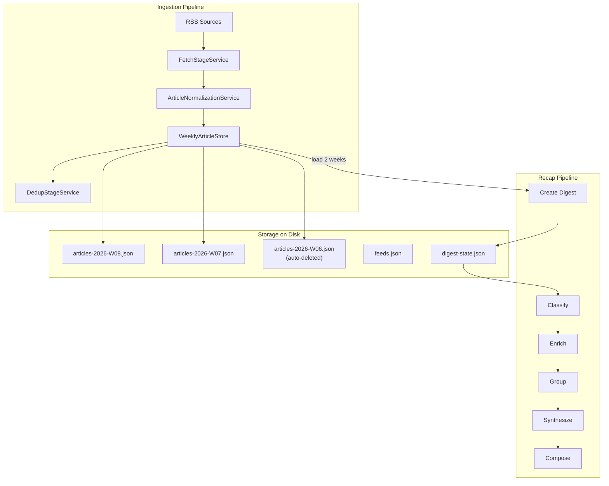

# Migrate to msgspec.Struct Storage

## Motivation

The current storage layer (SQLModel + Alembic + SQLiteRepository) accounts for ~3,000 lines of code — more than the entire business logic of the application. The problems:

- **Extremely small data volume.** ~1,000 articles in the database, ~20 RSS sources, a 2-3 day digest covers at most 6k articles. A full relational DB with migrations, indexes, and ORM for this volume is overengineering.
- **All 9 JOINs exist solely because of multi-user support.** The `UserArticle` table links `Article` to `user_id`. Removing multi-user removes `UserArticle`, which eliminates all JOINs.
- **Triple data shuffling.** Data lives in SQLModel models, gets converted to dataclasses for business logic, then serialized to JSON for agents. Three representations of the same thing — a source of bugs and boilerplate.
- **Pipeline state stored in normalized tables.** Each pipeline step (classify, enrich, group...) reads data from the DB via complex queries, processes it, and writes results back through `commit_with_retry`. Yet the pipeline processes one digest at a time — the relational model provides no advantage here.
- **Alembic migrations and schema management** for an unreleased, single-user application is pure ceremonial overhead.

## Success criteria

1. **Reduce storage layer from ~3,000 to ~650 lines** (>75% reduction). Measured as total volume of: models, repository, migration infra, pipeline I/O files.
2. **Single data representation.** The same `msgspec.Struct` is used for on-disk storage, inter-step pipeline transfer, and agent serialization. Zero hand-written `to_dict()`/`from_dict()` methods.
3. **Automatic GC.** Articles older than 2 weeks are deleted automatically by removing weekly partition files. No separate retention/prune/gc commands.
4. **Restart capability.** Each recap pipeline step saves a checkpoint (`digest.json`). On restart, the pipeline continues from the last checkpoint. Verified by test: interrupt after classify, restart — enrich begins without re-running classify.
5. **All existing tests pass** (adapted for the new storage). Coverage does not drop below 85%.
6. **Dependencies removed:** `sqlmodel`, `alembic` (and transitive `sqlalchemy`, `greenlet`). One added: `msgspec`.
7. **No data migration.** Old `.news_recap.db` is simply ignored. The app starts fresh with empty weekly stores on first run.

## Architecture



## Storage layout on disk

```
$NEWS_RECAP_DATA_DIR/          # default: .news_recap_data/
  ingestion/
    articles-2026-W08.json     # current week
    articles-2026-W07.json     # previous week
    feeds.json                 # RSS feed states + processing snapshots (~20 records)
    runs.json                  # recent ingestion runs (for CLI observability)
  recap/
    pipeline-2026-02-19-abc/
      digest.json              # Digest struct checkpoint (the pipeline state)
      classify/                # agent workdirs (existing pattern)
      enrich/
      ...
```

**Auto-GC rule:** On every ingestion run, delete any `articles-*.json` file older than 2 weeks. Week keys use ISO format `YYYY-Www` (zero-padded, e.g. `2026-W08`) so lexicographic comparison is safe across year boundaries:

```python
def gc_old_weeks(data_dir: Path, keep_weeks: int = 2):
    cutoff = _iso_week_str(datetime.now(UTC) - timedelta(weeks=keep_weeks))
    for f in (data_dir / "ingestion").glob("articles-*.json"):
        if f.stem.split("-", 1)[1] < cutoff:
            f.unlink()
```

**Atomic writes:** All file saves use write-to-temp + rename to avoid corruption on crash. No file locking — data is disposable, last writer wins. Pipeline steps must be designed as safe atomic changes to the digest (read-modify-checkpoint), so that concurrent access is prevented by pipeline design, not by storage infrastructure:

```python
def atomic_write(path: Path, data: bytes):
    tmp = Path(tempfile.mktemp(dir=path.parent, prefix=f".{path.name}."))
    tmp.write_bytes(data)
    tmp.rename(path)
```

**No historical reruns.** Once a weekly partition is GC'd, articles from that period are gone. Reruns are only supported within the 2-week retention window. This is by design — the data is cheap to re-ingest if ever needed.

## Domain models (all msgspec.Struct)

All current dataclasses in `src/news_recap/ingestion/models.py` and `src/news_recap/recap/models.py` become `msgspec.Struct`. All SQLModel classes in `src/news_recap/storage/sqlmodel_models.py` are **deleted** (no replacement needed -- their fields are absorbed into domain Structs).

### Ingestion Structs (replace both dataclasses AND SQLModel)

```python
class Article(msgspec.Struct):
    """Persisted article — replaces both Article SQLModel + NormalizedArticle dataclass."""
    article_id: str
    source_name: str
    external_id: str
    url: str
    url_canonical: str
    url_hash: str
    title: str
    source_domain: str
    published_at: datetime
    language_detected: str
    clean_text: str
    clean_text_chars: int
    is_full_content: bool
    is_truncated: bool
    ingested_at: datetime
    content_raw: str | None = None
    summary_raw: str | None = None
    fallback_key: str | None = None
    raw_json: str | None = None        # absorbs ArticleRaw

class WeeklyStore(msgspec.Struct):
    """One week of articles."""
    articles: dict[str, Article]       # article_id -> Article
    embeddings: dict[str, list[float]] = {}  # article_id -> vector, kept separate from Article to avoid bloating checkpoints

class FeedState(msgspec.Struct):
    source_name: str
    feed_url: str
    etag: str | None = None
    last_modified: str | None = None
    updated_at: datetime

class ProcessingSnapshot(msgspec.Struct):
    source_name: str
    feed_set_hash: str
    snapshot_json: str
    next_cursor: str | None = None
    updated_at: datetime

class FeedsStore(msgspec.Struct):
    feed_states: dict[str, FeedState]              # "source::url" -> state
    processing_snapshots: dict[str, ProcessingSnapshot]  # "source::hash" -> snapshot
```

### Recap Structs (denormalized digest)

```python
class DigestArticle(msgspec.Struct):
    """Article within a digest — carries pipeline state."""
    article_id: str
    title: str
    url: str
    source: str
    published_at: str
    clean_text: str
    verdict: str | None = None           # classify writes
    enriched_title: str | None = None    # enrich writes
    enriched_text: str | None = None     # deep-enrich writes
    resource_text: str | None = None     # fetched full-text resource

class DigestEvent(msgspec.Struct):
    event_id: str
    title: str
    significance: str
    articles: list[DigestArticle]        # denormalized
    narrative: str | None = None         # synthesize writes

class DigestBlock(msgspec.Struct):
    theme: str
    headline: str
    body: str
    sources: list[dict[str, str]]

class Digest(msgspec.Struct):
    digest_id: str
    business_date: str
    status: str                          # draft -> ready
    pipeline_dir: str
    articles: list[DigestArticle]
    events: list[DigestEvent] = []
    blocks: list[DigestBlock] = []
```

### Pipeline step pattern

```python
def run_classify(digest: Digest, ...) -> Digest:
    work = [a for a in digest.articles if a.verdict is None]
    if not work:
        return digest
    # materialize — work IS the input, encode directly
    agent_input = msgspec.json.encode(work)
    # ... run agent, get output ...
    verdicts = msgspec.json.decode(agent_stdout, type=dict[str, str])
    for a in digest.articles:
        if a.article_id in verdicts:
            a.verdict = verdicts[a.article_id]
    return digest

# Between steps: checkpoint (uses atomic_write)
def checkpoint(digest: Digest, path: Path):
    atomic_write(path, msgspec.json.encode(digest))

def load_digest(path: Path) -> Digest:
    return msgspec.json.decode(path.read_bytes(), type=Digest)
```

## Files to DELETE (entire files removed)

| File | Lines | Why |
|------|-------|-----|
| `src/news_recap/storage/sqlmodel_models.py` | 375 | Replaced by msgspec Structs |
| `src/news_recap/storage/common.py` | 77 | SQLite engine builders no longer needed |
| `src/news_recap/storage/alembic_runner.py` | 22 | No more Alembic |
| `alembic/env.py` | 59 | No more Alembic |
| `alembic/versions/20260217_0001_initial_multiuser.py` | 341 | No more migrations |
| `alembic/script.py.mako` | 19 | No more Alembic |
| `alembic.ini` | 36 | No more Alembic |
| `tests/test_migrations.py` | ~30 | No more migrations |
| **Total deleted** | **~960** | |

## Files to REWRITE substantially

### `src/news_recap/ingestion/repository.py` (1,510 lines -> ~350 lines)

Replace `SQLiteRepository` with `IngestionStore` class:
- `__init__`: takes `data_dir: Path` instead of `db_path`
- Load/save weekly files via msgspec encode/decode
- All methods become dict/list operations (no Session, no SQL)
- Remove ALL `user_id` parameters and filtering (~80 occurrences)
- `gc_old_weeks()` for auto-cleanup

### `src/news_recap/recap/flow.py`

Each step reads/writes Digest struct directly:
- Remove `commit_with_retry`, `DebugStopError`
- Remove all `SQLiteRepository` usage
- Each step: load digest -> filter -> run agent -> update -> checkpoint

### `src/news_recap/recap/launcher.py`

- Remove `SQLiteRepository` import and usage
- Create Digest from IngestionStore articles
- Pass Digest to flow

### `src/news_recap/recap/pipeline_io.py`

- Remove `commit_with_retry`, `DebugStopError`
- Simplify to just `checkpoint()`/`load_digest()` + input hash logic

### `src/news_recap/ingestion/models.py` (245 lines -> ~200 lines)

- Change `@dataclass(slots=True)` to `msgspec.Struct` for all classes
- Remove manual `to_dict()`/`from_dict()` methods
- Keep enums as-is (msgspec handles them)

### `src/news_recap/recap/models.py` (44 lines -> ~10 lines)

- `SourceCorpusEntry` is replaced by `DigestArticle` msgspec.Struct
- Delete `to_dict()`/`from_dict()` — msgspec handles this
- Agent output references articles by `article_id`; the pipeline matches results back to `digest.articles` by that key — no separate `source_id` needed
- Update task I/O code (`articles_index.json` builders, prompt builders, output parsers, tests) to use `DigestArticle` and `article_id` instead of `SourceCorpusEntry` and `source_id`

## Files to MODIFY (smaller changes)

- `src/news_recap/config.py` — remove `db_path`, add `data_dir`; remove `user_id`/`UserContextSettings`
- `src/news_recap/main.py` — update CLI options (`--data-dir` instead of `--db-path`); remove `--user-id`
- `src/news_recap/ingestion/controllers.py` — use `IngestionStore` instead of `SQLiteRepository`; remove `user_id`
- `src/news_recap/ingestion/pipeline.py` — use `IngestionStore`
- `src/news_recap/ingestion/services/fetch_service.py` — use `IngestionStore`
- `src/news_recap/ingestion/services/dedup_service.py` — use `IngestionStore`
- `src/news_recap/recap/routing.py` — remove `utc_now` import from `storage.common`
- `pyproject.toml` — remove `sqlmodel`, `alembic`; add `msgspec`
- `CLAUDE.md` / `AGENTS.md` — update architecture description

## Tests to update

- `tests/test_repository.py` (~850 lines) — rewrite for `IngestionStore` (no SQLModel sessions)
- `tests/test_pipeline.py` (~450 lines) — update fixtures
- `tests/test_ingest_observability_cli.py` (~400 lines) — remove raw SQL, use store directly
- `tests/test_orchestrator_routing.py` — minor (remove user_id references)

## Dependencies

**Remove:** `sqlmodel>=0.0.22`, `alembic>=1.16.0` (+ transitive: sqlalchemy, greenlet)
**Add:** `msgspec>=0.19`

## Line count impact

| | Before | After | Delta |
|---|--------|-------|-------|
| Storage models | 375 | 0 | -375 |
| Alembic infra | 477 | 0 | -477 |
| Repository | 1,510 | ~350 | -1,160 |
| Recap models | 44 | ~10 | -34 |
| Recap flow/IO | ~600 | ~300 | -300 |
| **Net** | **~3,000** | **~660** | **-2,340** |
