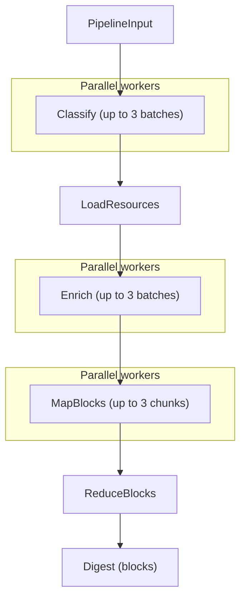

# Recap Pipeline

Developer specification for the daily recap pipeline.
This document describes the runtime behaviour implemented in
`src/news_recap/recap/flow.py` and its task modules.

## Pipeline overview



The Prefect flow `recap_flow` runs the five steps in fixed order:

1. **Classify** — batch-classify articles as `ok / vague / follow / exclude`.
2. **LoadResources** — download full-text for articles needing enrichment.
3. **Enrich** — rewrite headlines and extract excerpts via LLM agents.
4. **MapBlocks** — group headlines into titled blocks (parallel workers).
5. **ReduceBlocks** — merge overlapping blocks into the final digest.

Steps 1, 3, and 4 run up to `_MAX_PARALLEL = 3` concurrent Prefect tasks.
Steps 2 and 5 are single-threaded.

## Per-step contracts

### Classify

| | |
|---|---|
| **Module** | `recap/tasks/classify.py` |
| **Task type** | `recap_classify` |
| **LLM I/O** | Inline prompt with numbered headlines; agent prints verdicts to stdout |
| **Reads** | `ctx.inp.articles`, `ctx.inp.preferences` |
| **Writes state** | `kept_entries` — `list[ArticleIndexEntry]` (non-excluded articles) |
| | `enrich_ids` — `list[str]` (article IDs with verdict `vague` or `follow`) |
| **Writes digest** | `articles[].verdict` |

Headlines are numbered 1..N in the prompt. The agent prints one line per
headline: `NUMBER: VERDICT`. Verdicts: `ok`, `vague`, `follow`, `exclude`.

Batching: articles are split into batches of 50–300, up to 3 parallel
workers. A char-budget check prevents prompts from exceeding 60 000 chars.
Recognition rate below 80% raises `RecapPipelineError`. Batch success rate
below 80% also raises.

### LoadResources

| | |
|---|---|
| **Module** | `recap/tasks/load_resources.py` |
| **Task type** | *(no LLM — HTTP fetch)* |
| **Reads state** | `enrich_ids` |
| **Writes state** | `enrich_ids` — filtered to only successfully loaded articles |
| **Writes digest** | `articles[].resource_loaded`, `articles[].verdict` (reset to `ok` on failure) |

Downloads article full-text via `load_resource_texts` and caches it under
the pipeline directory. Articles that fail to load get their verdict reset
to `ok` (so they still appear in the digest but won't be enriched). Failure
rate above 30% raises `RecapPipelineError`.

### Enrich

| | |
|---|---|
| **Module** | `recap/tasks/enrich.py` |
| **Task type** | `recap_enrich` |
| **LLM I/O** | Inline prompt with article texts; agent prints new headlines to stdout |
| **Reads state** | `enrich_ids` |
| **Writes state** | `enriched_articles` — `dict[article_id, str]` (article_id → new headline) |
| **Writes digest** | `articles[].enriched_title` |

Articles are embedded directly in the prompt, separated by `===ARTICLE===`.
Each article block contains: number, headline, blank line, body text
(truncated to 5 000 chars). The agent prints new headlines to stdout:
number on one line, headline on the next, then a blank line.

Batching: char-budget based — each batch stays within 60 000 chars of
article text and at most 20 articles, up to 3 parallel workers.
Recognition rate below 50% raises `RecapPipelineError`. Unprocessed
articles are retried for up to 3 rounds. If a round makes no progress the
loop stops early. Partial results are persisted; `fully_completed` is set
to `False` so the step re-runs on the next pipeline invocation.

### MapBlocks

| | |
|---|---|
| **Module** | `recap/tasks/map_blocks.py` |
| **Task type** | `recap_map` |
| **LLM I/O** | Inline prompt with numbered headlines; agent prints `BLOCK:` lines to stdout |
| **Reads state** | `kept_entries`, `enriched_articles` |
| **Writes state** | `map_blocks` — `list[{"title": str, "article_ids": list[str], "worker": int}]` |

Enriched titles are merged into the index before chunking. Entries are
split into chunks of ~300, each chunk sent to a parallel worker.

Target block count: `max(5, len(entries) // 15)`, divided among workers.
Output format per worker:

```
BLOCK: <2-4 sentence title>
<comma-separated headline numbers>
```

Validation: headline coverage below 50% raises `RecapPipelineError`;
below 80% logs a warning. Unassigned headlines go into an `Uncategorized`
block. Worker success rate below 50% or zero total blocks raises.

### ReduceBlocks

| | |
|---|---|
| **Module** | `recap/tasks/reduce_blocks.py` |
| **Task type** | `recap_reduce` |
| **LLM I/O** | Block index inline in prompt; file-based article lists (`input/blocks/` → `output/blocks/`) |
| **Reads state** | `map_blocks`, `enriched_articles`, `ctx.article_map` |
| **Writes digest** | `blocks` — `list[DigestBlock]` (final output) |

A single LLM agent receives:

- **In the prompt**: a block index listing each input file and its title.
- **On disk**: `input/blocks/w{worker}_b{index}.txt` — one file per MAP
  block. Line 1 = title, remaining lines = `article_id: headline`.

The agent writes merged/split blocks to `output/blocks/*.txt` in the same
format. Fallback: if no output blocks are parsed, MAP blocks are used
directly and the step result status is set to `degraded`.

## State and checkpointing

Two layers of state flow through the pipeline:

| Layer | Storage | Scope |
|---|---|---|
| `FlowContext.state` | In-memory `dict` | Ephemeral — lost between pipeline invocations |
| `Digest` | `digest.json` in pipeline dir | Persistent — survives restarts |

After each step, `ctx.save_checkpoint()` serializes the `Digest` to
`digest.json`. On the next invocation, if a checkpoint exists, the flow
resumes from it.

### Phase skipping

`Digest.completed_phases` is a list of step names. When `TaskLauncher.run()`
sees the step name already present it skips execution and calls
`restore_state()` instead — this method reconstructs the `ctx.state` entries
that downstream steps depend on, reading from the persisted `Digest`.

If a step sets `fully_completed = False` (partial results), its name is
*not* added to `completed_phases`, so it re-runs on the next invocation.

### Early stopping

`stop_after` (set via argument or `NEWS_RECAP_STOP_AFTER` env var) halts
the pipeline after the named step completes by raising `StopPipelineError`.
The flow catches this and marks the run as completed.

## Output shape

The final digest contains:

```
Digest
  digest_id: str
  business_date: str
  status: str
  articles: list[DigestArticle]
  blocks: list[DigestBlock]
  completed_phases: list[str]
```

Each `DigestBlock` has:

- `title` — 2-4 sentence summary produced by MAP/REDUCE.
- `article_ids` — references to `DigestArticle.article_id` entries.

There is no event layer; blocks reference articles directly.
