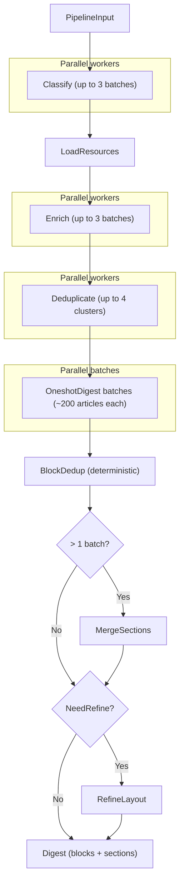

# Recap Pipeline

Developer specification for the daily recap pipeline.
This document describes the runtime behaviour implemented in
`src/news_recap/recap/flow.py` and its task modules.

> Instead of throwing raw headlines into one oversized prompt, `news-recap`
> processes news through a layered recap workflow that reduces noise, groups related stories,
> and produces a cleaner daily digest.

## Pipeline overview



The flow `recap_flow` runs steps in fixed order (8 steps):

1. **Classify** — batch-classify articles as `ok / vague / exclude`.
2. **LoadResources** — download full-text for articles needing enrichment.
3. **Enrich** — rewrite headlines and extract excerpts via LLM agents.
4. **Deduplicate** — merge near-duplicate articles (embedding pre-filter + LLM clustering).
5. **OneshotDigest** — articles split into batches of ~200, processed in parallel; each batch agent groups and titles blocks and sections in one pass.
6. **BlockDedup** *(deterministic, no LLM)* — removes exact-duplicate, subset, and semantically similar blocks.
7. **MergeSections** *(only when > 1 batch)* — reconciles section names from all batches into a unified section list.
8. **RefineLayout** *(optional, gated)* — a single LLM call that absorbs small (1–2 block) sections into semantically fitting larger sections; sections with 3+ blocks are left untouched. Skipped when all sections already have ≥ 3 blocks.

Steps 1, 3, 4, and 5 run up to `_MAX_PARALLEL` concurrent workers.
Steps 2, 6–8 are single-threaded.

## Per-step contracts

### Classify

| | |
|---|---|
| **Module** | `recap/tasks/classify.py` |
| **Task type** | `recap_classify` |
| **LLM I/O** | Inline prompt with numbered headlines; agent prints verdicts to stdout |
| **Reads** | `ctx.inp.articles`, `ctx.inp.preferences` |
| **Writes state** | `kept_entries` — `list[ArticleIndexEntry]` (articles with verdict `ok` or `vague`) |
| | `enrich_ids` — `list[str]` (article IDs with verdict `vague`, routed to LoadResources/Enrich) |
| **Writes digest** | `articles[].verdict` |

Headlines are numbered 1..N in the prompt. The agent prints one line per
headline: `NUMBER: VERDICT`. Verdicts: `ok`, `vague`, `exclude`.

- `ok` — article is kept as-is; added to `kept_entries`.
- `vague` — headline is too vague to understand without reading the article; kept in `kept_entries` and added to `enrich_ids` so LoadResources fetches the full text and Enrich rewrites the headline.
- `exclude` — article is dropped entirely.

Batching: articles are split into batches of 50–300, up to 3 parallel
workers. A char-budget check prevents prompts from exceeding 60 000 chars.
Recognition rate below 80% raises `RecapPipelineError`. Batch success rate
below 80% also raises.

### LoadResources

| | |
|---|---|
| **Module** | `recap/tasks/load_resources.py` |
| **Task type** | *(no LLM — HTTP fetch)* |
| **Reads state** | `enrich_ids` |
| **Writes state** | `enrich_ids` — filtered to only successfully loaded articles |
| **Writes digest** | `articles[].resource_loaded`, `articles[].verdict` (reset to `ok` on failure) |

Downloads full-text for `vague` articles via `load_resource_texts` and caches
it under the pipeline directory. Articles that fail to load (or have no URL)
get their verdict reset to `ok` — they remain in the digest with their
original headline but won't be enriched. Failure rate above 30% raises
`RecapPipelineError`.

### Enrich

| | |
|---|---|
| **Module** | `recap/tasks/enrich.py` |
| **Task type** | `recap_enrich` |
| **LLM I/O** | Inline prompt with article texts; agent prints new headlines to stdout |
| **Reads state** | `enrich_ids` |
| **Writes state** | `enriched_articles` — `dict[article_id, str]` (article_id → new headline) |
| **Writes digest** | `articles[].enriched_title` |

Articles are embedded directly in the prompt, separated by `===ARTICLE===`.
Each article block contains: number, headline, blank line, body text
(truncated to 5 000 chars). The agent prints new headlines to stdout:
number on one line, headline on the next, then a blank line.

Batching: char-budget based — each batch stays within 60 000 chars of
article text and at most 20 articles, up to 3 parallel workers.
Recognition rate below 50% raises `RecapPipelineError`. Unprocessed
articles are retried for up to 3 rounds. If a round makes no progress the
loop stops early. Partial results are persisted; `fully_completed` is set
to `False` so the step re-runs on the next pipeline invocation.

### Deduplicate

| | |
|---|---|
| **Module** | `recap/tasks/deduplicate.py` |
| **Task type** | `recap_dedup` |
| **LLM I/O** | Per-cluster prompt with numbered articles; agent prints `MERGED:` / `SINGLE:` lines |
| **Reads** | `ctx.digest.articles` (all articles after Enrich) |
| **Writes digest** | Removes duplicate `DigestArticle` entries; sets `enriched_title` on the keeper |

Two-phase process:

1. **Embedding pre-filter** — sentence-transformer embeddings are computed for
   all articles and grouped by cosine similarity above `dedup_threshold`
   (default 0.90). Groups below size 2 are skipped.
2. **LLM clustering** — each similarity group is sent to an LLM agent that
   prints one of two line types per article:

```
MERGED: <merged headline>
<comma-separated article numbers>

SINGLE: <number>
```

`MERGED` actions keep the article with the most `clean_text`, set its
`enriched_title` to the merged headline, and add the other URLs to
`alt_urls`. Removed article IDs are also pruned from `ctx.state["kept_entries"]`.

Up to 4 clusters run in parallel. Partial failures are tolerated:
`fully_completed = False` is set and a warning logged, but the pipeline
continues.

### OneshotDigest

| | |
|---|---|
| **Module** | `recap/tasks/oneshot_digest.py` |
| **Task type** | `recap_oneshot_digest` |
| **LLM I/O** | Articles split into batches; each batch agent prints `SECTION:` / `BLOCK:` / `ARTICLES:` / `EXCLUDED:` lines; a merge agent reconciles section names |
| **Reads** | `ctx.digest.articles` |
| **Writes digest** | `blocks` — `list[DigestBlock]`, `recaps` — `list[DigestSection]` |

Articles are pre-sorted by embedding similarity, then split into batches of
`_BATCH_SIZE` (default 200). Each batch is processed by a parallel `recap_oneshot_digest`
agent. After all batches complete, a deterministic block dedup pass runs
(see Block Dedup below). When more than one batch is used, a follow-up
`recap_merge_sections` call receives only the section names from all batches
and produces the final consolidated section list (see MergeSections below).

Coverage below 50% of non-excluded articles raises `RecapPipelineError`.

Per-batch output format:

```
SECTION: <section title>
SECTION_SUMMARY: <1-2 sentences>
BLOCK: <block title>
SUMMARY: <2-4 sentences>
ARTICLES: <comma-separated numbers>

EXCLUDED: <comma-separated numbers>
```

### Block Dedup

| | |
|---|---|
| **Module** | `recap/tasks/oneshot_digest.py` (`_dedup_blocks`) |
| **Task type** | *(no LLM — deterministic set operations)* |
| **Invoked by** | `OneshotDigest` after all batch agents complete |

Removes redundant blocks in three phases:

1. **Exact-duplicate removal** — blocks whose `article_ids` form the same
   set (order-insensitive) are grouped. The block with the longest title is
   kept; ties broken by earlier position.
2. **Subset absorption** — if block A's article-ID set is a strict subset
   of block B's, A is absorbed into B. When A is a subset of multiple
   supersets, the smallest superset wins (closest match). Chained subsets
   (A⊂B⊂C) are resolved transitively.
3. **Fuzzy title merge** — block titles are embedded via the same
   `SentenceTransformerEmbedder` already loaded for article pre-sorting.
   Blocks whose title embeddings have cosine similarity ≥ 0.90 are
   clustered (connected components via `group_similar`).  Within each
   cluster the block with the most articles wins (longest title, then
   earliest position as tiebreakers); `article_ids` from all cluster
   members are combined.  This catches cross-batch overlaps where two
   batches independently created blocks about the same story with
   different article sets — something Phases 1–2 cannot detect because
   they compare article-ID sets only.

After removal, all `DigestSection.block_indices` are remapped to the
compacted block list. Duplicate indices within a section are deduplicated
while preserving order. Sections that lose all blocks are dropped.

Phases 1–2 compensate for LLM non-determinism: the oneshot prompt
instructs that each article number must appear in exactly one block, but
in practice ~10% of articles end up in multiple blocks — producing
duplicate and subset blocks.  Phase 3 addresses a different issue: with
multiple batches, two LLM calls may independently group different
articles into blocks covering the same story.  All three phases run
without additional LLM calls.

### MergeSections

| | |
|---|---|
| **Module** | `recap/tasks/oneshot_digest.py` (internal to `OneshotDigest`) |
| **Task type** | `recap_merge_sections` |
| **LLM I/O** | Numbered section names from all batches; agent prints `SECTION:` / `SECTION_SUMMARY:` / `INCLUDES:` lines |
| **Invoked by** | `OneshotDigest` when article count exceeds one batch |

Receives only the section titles from all batches (not article content).
Groups related sections under a canonical name and writes a combined summary.

Output format:

```
SECTION: <canonical section name>
SECTION_SUMMARY: <one sentence combining coverage of the group>
INCLUDES: <comma-separated input section numbers>
```

Every input section number must appear in exactly one `INCLUDES` line.
A section that stands alone has only its own number in `INCLUDES`.

### RefineLayout

| | |
|---|---|
| **Module** | `recap/tasks/refine_layout.py` |
| **Task type** | `recap_refine_layout` |
| **LLM I/O** | Section titles + numbered block titles in prompt; agent prints `SECTION:` / `SECTION_SUMMARY:` / `BLOCKS:` lines |
| **Reads digest** | `blocks`, `recaps` |
| **Writes digest** | `recaps` — `list[DigestSection]` (rewritten; blocks untouched) |

Optional post-processing step that runs after OneshotDigest (including
BlockDedup and MergeSections).  Gated by `needs_refinement`: skipped when
all sections have ≥ 3 blocks.

Conservative refinement: relocates blocks from sections with 1–2 blocks
into semantically fitting larger sections.  Sections with 3+ blocks are
left untouched — no renaming, no block removal.  The prompt sends section
titles and numbered block titles (no article IDs or block summaries);
small sections are tagged `[SMALL]` in the input so the LLM knows which
sections are candidates for absorption.

Output format:

```
SECTION: <section title>
SECTION_SUMMARY: <one sentence>
BLOCKS: <comma-separated block numbers>
```

Validation: every block number (1..N) must appear exactly once across all
`BLOCKS` lines.  Up to 5% omitted blocks are tolerated (auto-appended to
the last section with a warning).  On invalid output (duplicates, >5%
missing, unparseable), the step falls back to the pre-refinement sections.

This is a separate checkpoint from OneshotDigest.  `restore_state()` is a
no-op (blocks and recaps are already in the checkpoint).

## State and checkpointing

Two layers of state flow through the pipeline:

| Layer | Storage | Scope |
|---|---|---|
| `FlowContext.state` | In-memory `dict` | Ephemeral — lost between pipeline invocations |
| `Digest` | `digest.json` in pipeline dir | Persistent — survives restarts |

After each step, `ctx.save_checkpoint()` serializes the `Digest` to
`digest.json`. On the next invocation, if a checkpoint exists, the flow
resumes from it.

### Phase skipping

`Digest.completed_phases` is a list of step names. When `TaskLauncher.run()`
sees the step name already present it skips execution and calls
`restore_state()` instead — this method reconstructs the `ctx.state` entries
that downstream steps depend on, reading from the persisted `Digest`.

If a step sets `fully_completed = False` (partial results), its name is
*not* added to `completed_phases`, so it re-runs on the next invocation.

### Early stopping

`stop_after` (set via argument or `NEWS_RECAP_STOP_AFTER` env var) halts
the pipeline after the named step completes by raising `StopPipelineError`.
The flow catches this and marks the run as completed.

Valid `stop_after` values: `classify`, `load_resources`, `enrich`,
`deduplicate`, `oneshot_digest`, `refine_layout`.

## Output shape

The final digest contains:

```
Digest
  digest_id: str
  run_date: str
  status: str
  articles: list[DigestArticle]
  blocks: list[DigestBlock]
  recaps: list[DigestSection]
  day_summary: str
  completed_phases: list[str]
```

Each `DigestBlock` has:

- `title` — short topic label.
- `summary` — 2-4 sentence prose describing what happened.
- `article_ids` — references to `DigestArticle.article_id` entries.

Each `DigestSection` has:

- `title` — short section label.
- `summary` — 1-2 sentence overview of the section topic.
- `block_indices` — zero-based indices into `blocks`.

There is no event layer; blocks reference articles directly.

## Cost

Each digest pipeline run consumes roughly 3–4% of the weekly CLI agent
subscription quota (~\$0.19 per run).  At daily use this adds up to
~20% of the weekly limit, or ~\$6/month in equivalent dollar terms.

The dollar figures are approximate.  The pipeline runs under flat-rate
subscriptions (Codex, Claude Code, Gemini CLI at ~\$20/month), so
the quota would mostly go unused anyway — the pipeline effectively
runs for free within the existing subscription.

An API-key mode (`--api`) is available using Haiku for most tasks and
Sonnet for the oneshot digest.  It is faster per-token but adds up to
~\$13/month at daily use.  API mode is mainly useful for environments
where CLI agents are not available.

## Experiments

All experiments below were run on the same 703-article corpus (25 Mar 2026)
using Claude CLI agents under a \$20/month subscription.

### Pipeline tuning

Before settling on the current pipeline, an alternative **map-reduce**
approach was evaluated.  It used five LLM stages after Deduplicate:

1. **MapBlocks** — split headlines into chunks of ~300 and group each chunk
   into titled blocks in parallel.
2. **ReduceBlocks** — merge overlapping block titles from all map workers
   into a unified list; mark overly broad blocks as SPLIT.
3. **SplitBlocks** — break SPLIT-marked blocks into smaller thematic
   sub-blocks (parallel workers).
4. **GroupSections** — cluster the flat block list into reader-facing
   sections with short topic labels.
5. **Summarize** — produce a heading + bulleted day summary from the
   section structure.

| | Map-reduce | Oneshot (no refine) | Oneshot + RefineLayout |
|---|---|---|---|
| Time | 26 min | 5–7 min | 6–8 min |
| Blocks | 158 | 239 | 182 |
| Sections | 24 | 33 | 27 |
| Sections ≤ 2 blocks | 0 | 8 | 3 |
| Max section size | 14 | 25 | 18 |
| Avg section size | 6.6 | 7.4 | 7.1 |
| Article coverage | 100% | 98% | 97% |
| Day summary | yes (global) | per-section only | per-section only |
| Sub. cost / run | ~\$0.23 (5% weekly) | ~\$0.16 (3.5%) | ~\$0.19 (4%) |

**Map-reduce** produced the most compact output — the reduce step merged
overlapping blocks across map shards, resulting in fewer, denser blocks.
Sections were well-separated.  Downsides: 4× slower, ~20% more expensive,
mixed-language section titles in some runs, and no per-section summaries.

**Oneshot without refine** is the fastest option.  Articles are pre-sorted
by embedding similarity and split into batches of ~200, processed in
parallel.  Deterministic block dedup (exact + subset + fuzzy title merge)
removes redundant blocks.  Main weakness: 8–12 orphan sections with 1–2
blocks that fragment the reading experience.

**Oneshot + RefineLayout** adds one lightweight LLM call after block dedup
and section merge.  Conservative refinement: the LLM is constrained to
only absorb `[SMALL]` (1–2 block) sections into existing larger sections
where the thematic fit is clear.  Sections with 3+ blocks are untouched.
Result: 33 → 27 sections, 3 remaining small sections (none has a clear
larger home), max section size 18, average 7.1.

The best qualities of the map-reduce approach (semantic block merging) were
incorporated into the oneshot pipeline as the fuzzy title merge phase of
BlockDedup, making the five extra LLM stages unnecessary.  The map-reduce
code was removed.

### API mode

See [Cost](#cost) for API mode details and pricing comparison.
