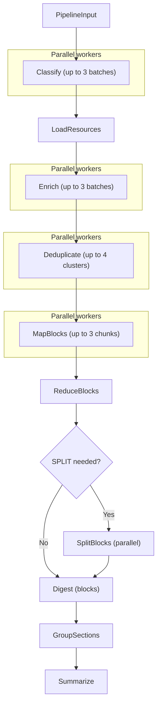

# Recap Pipeline

Developer specification for the daily recap pipeline.
This document describes the runtime behaviour implemented in
`src/news_recap/recap/flow.py` and its task modules.

## Pipeline overview



The flow `recap_flow` runs the nine steps in fixed order:

1. **Classify** — batch-classify articles as `ok / vague / exclude`.
2. **LoadResources** — download full-text for articles needing enrichment.
3. **Enrich** — rewrite headlines and extract excerpts via LLM agents.
4. **Deduplicate** — merge near-duplicate articles (embedding pre-filter + LLM clustering).
5. **MapBlocks** — group headlines into titled blocks (parallel workers).
6. **ReduceBlocks** — merge overlapping block titles into a unified list.
7. **SplitBlocks** — break broad blocks into thematic sub-blocks (parallel workers, only if reduce produced SPLIT markers).
8. **GroupSections** — cluster blocks into reader-friendly sections with short topic labels.
9. **Summarize** — produce a heading + bulleted day summary from the section structure.

Steps 1, 3, 4, 5, and 7 run up to `_MAX_PARALLEL` concurrent workers.
Steps 2, 6, 8, and 9 are single-threaded.

## Per-step contracts

### Classify

| | |
|---|---|
| **Module** | `recap/tasks/classify.py` |
| **Task type** | `recap_classify` |
| **LLM I/O** | Inline prompt with numbered headlines; agent prints verdicts to stdout |
| **Reads** | `ctx.inp.articles`, `ctx.inp.preferences` |
| **Writes state** | `kept_entries` — `list[ArticleIndexEntry]` (articles with verdict `ok` or `vague`) |
| | `enrich_ids` — `list[str]` (article IDs with verdict `vague`, routed to LoadResources/Enrich) |
| **Writes digest** | `articles[].verdict` |

Headlines are numbered 1..N in the prompt. The agent prints one line per
headline: `NUMBER: VERDICT`. Verdicts: `ok`, `vague`, `exclude`.

- `ok` — article is kept as-is; added to `kept_entries`.
- `vague` — headline is too vague to understand without reading the article; kept in `kept_entries` and added to `enrich_ids` so LoadResources fetches the full text and Enrich rewrites the headline.
- `exclude` — article is dropped entirely.

Batching: articles are split into batches of 50–300, up to 3 parallel
workers. A char-budget check prevents prompts from exceeding 60 000 chars.
Recognition rate below 80% raises `RecapPipelineError`. Batch success rate
below 80% also raises.

### LoadResources

| | |
|---|---|
| **Module** | `recap/tasks/load_resources.py` |
| **Task type** | *(no LLM — HTTP fetch)* |
| **Reads state** | `enrich_ids` |
| **Writes state** | `enrich_ids` — filtered to only successfully loaded articles |
| **Writes digest** | `articles[].resource_loaded`, `articles[].verdict` (reset to `ok` on failure) |

Downloads full-text for `vague` articles via `load_resource_texts` and caches
it under the pipeline directory. Articles that fail to load (or have no URL)
get their verdict reset to `ok` — they remain in the digest with their
original headline but won't be enriched. Failure rate above 30% raises
`RecapPipelineError`.

### Enrich

| | |
|---|---|
| **Module** | `recap/tasks/enrich.py` |
| **Task type** | `recap_enrich` |
| **LLM I/O** | Inline prompt with article texts; agent prints new headlines to stdout |
| **Reads state** | `enrich_ids` |
| **Writes state** | `enriched_articles` — `dict[article_id, str]` (article_id → new headline) |
| **Writes digest** | `articles[].enriched_title` |

Articles are embedded directly in the prompt, separated by `===ARTICLE===`.
Each article block contains: number, headline, blank line, body text
(truncated to 5 000 chars). The agent prints new headlines to stdout:
number on one line, headline on the next, then a blank line.

Batching: char-budget based — each batch stays within 60 000 chars of
article text and at most 20 articles, up to 3 parallel workers.
Recognition rate below 50% raises `RecapPipelineError`. Unprocessed
articles are retried for up to 3 rounds. If a round makes no progress the
loop stops early. Partial results are persisted; `fully_completed` is set
to `False` so the step re-runs on the next pipeline invocation.

### Deduplicate

| | |
|---|---|
| **Module** | `recap/tasks/deduplicate.py` |
| **Task type** | `recap_dedup` |
| **LLM I/O** | Per-cluster prompt with numbered articles; agent prints `MERGED:` / `SINGLE:` lines |
| **Reads** | `ctx.digest.articles` (all articles after Enrich) |
| **Writes digest** | Removes duplicate `DigestArticle` entries; sets `enriched_title` on the keeper |

Two-phase process:

1. **Embedding pre-filter** — sentence-transformer embeddings are computed for
   all articles and grouped by cosine similarity above `dedup_threshold`
   (default 0.90). Groups below size 2 are skipped.
2. **LLM clustering** — each similarity group is sent to an LLM agent that
   prints one of two line types per article:

```
MERGED: <merged headline>
<comma-separated article numbers>

SINGLE: <number>
```

`MERGED` actions keep the article with the most `clean_text`, set its
`enriched_title` to the merged headline, and add the other URLs to
`alt_urls`. Removed article IDs are also pruned from `ctx.state["kept_entries"]`.

Up to 4 clusters run in parallel. Partial failures are tolerated:
`fully_completed = False` is set and a warning logged, but the pipeline
continues.

### MapBlocks

| | |
|---|---|
| **Module** | `recap/tasks/map_blocks.py` |
| **Task type** | `recap_map` |
| **LLM I/O** | Inline prompt with numbered headlines; agent prints `BLOCK:` lines to stdout |
| **Reads state** | `kept_entries`, `enriched_articles` |
| **Writes state** | `map_blocks` — `list[{"title": str, "article_ids": list[str], "worker": int}]` |

Enriched titles are merged into the index before chunking. Entries are
split into chunks of ~300, each chunk sent to a parallel worker.

Target block count: `max(5, len(entries) // 15)`, divided among workers.
Output format per worker:

```
BLOCK: <2-4 sentence title>
<comma-separated headline numbers>
```

Validation: headline coverage below 50% raises `RecapPipelineError`;
below 80% logs a warning. Unassigned headlines go into an `Uncategorized`
block. Worker success rate below 50% or zero total blocks raises.

### ReduceBlocks

| | |
|---|---|
| **Module** | `recap/tasks/reduce_blocks.py` |
| **Task type** | `recap_reduce` |
| **LLM I/O** | All block titles inline in prompt; agent prints `BLOCK:` / `SPLIT:` lines to stdout |
| **Reads state** | `map_blocks` |
| **Writes state** | `split_tasks` — `list[SplitTask]` (blocks that need splitting) |
| **Writes digest** | `blocks` — `list[DigestBlock]` (BLOCK-line results; SPLIT blocks added later) |

A single LLM agent receives numbered block titles with article counts.
The agent outputs one of two line types per block:

```
BLOCK: <informative title>
<comma-separated source block numbers>

SPLIT: <best-effort combined title>
<comma-separated source block numbers>
```

BLOCK actions are applied in code — article IDs from source blocks are
concatenated and the new title is used. SPLIT actions are queued for the
next phase. Omitted source blocks are treated as implicit single-block
BLOCK actions (with a warning). If stdout is missing or unparseable, the
step falls back to MAP blocks as-is.

### SplitBlocks

| | |
|---|---|
| **Module** | `recap/tasks/split_blocks.py` |
| **Task type** | `recap_split` |
| **LLM I/O** | Article headlines inline in prompt; agent prints `BLOCK:` lines to stdout |
| **Reads state** | `split_tasks`, `enriched_articles`, `ctx.article_map` |
| **Writes digest** | Appends to `blocks` — `list[DigestBlock]` |

Runs only when REDUCE produced SPLIT markers. Each split task is small
(typically 5-20 articles) and independent — they run in parallel (up to
5 concurrent workers). The agent receives numbered article headlines and
outputs `BLOCK:` lines with article numbers. Coverage below 50% raises
`RecapPipelineError`. Unassigned articles are appended to the last block.

If the step is skipped (no split tasks), no work is done. On worker
failure, partial results are saved and `RecapPipelineError` is raised.

### GroupSections

| | |
|---|---|
| **Module** | `recap/tasks/group_sections.py` |
| **Task type** | `recap_group_sections` |
| **LLM I/O** | Numbered block titles in prompt; agent prints `SECTION:` lines to stdout |
| **Reads digest** | `blocks` |
| **Writes digest** | `recaps` — `list[DigestSection]` |

Takes the flat list of `DigestBlock` objects produced by MAP/REDUCE/SPLIT
and asks an LLM to cluster them into sections with short topic labels.

Output format:

```
SECTION: <short topic label>
<comma-separated block numbers>
```

Post-parse guardrails:
- Single-block sections are merged into the nearest neighbour.
- Orphan blocks (not assigned to any section) are appended to the last section.
- Sections exceeding 10 blocks generate a warning.

When the block count is ≤ 3, the LLM call is skipped and all blocks go
into a single catch-all section (language-aware title).

### Summarize

| | |
|---|---|
| **Module** | `recap/tasks/summarize.py` |
| **Task type** | `recap_summarize` |
| **LLM I/O** | Section + block hierarchy in prompt; agent outputs freeform text between markers |
| **Reads digest** | `recaps`, `blocks` |
| **Writes digest** | `day_summary` — `str` |

Receives the full section/block structure and writes a heading + bulleted
storylines summary in the digest language. Output is delimited by
`SUMMARY_START` / `SUMMARY_END` markers.

If `recaps` is empty (no sections), the step is skipped and `day_summary`
is set to an empty string.

### OneshotDigest

| | |
|---|---|
| **Module** | `recap/tasks/oneshot_digest.py` |
| **Task type** | `recap_oneshot_digest` |
| **LLM I/O** | All article headlines in one prompt; agent prints `SECTION:` / `BLOCK:` / `ARTICLES:` / `EXCLUDED:` lines |
| **Reads** | `ctx.digest.articles` |
| **Writes digest** | `blocks` — `list[DigestBlock]`, `recaps` — `list[DigestSection]` |

Alternative to the five-step MAP→REDUCE→SPLIT→GROUP→SUMMARIZE pipeline.
Activated via `--oneshot` CLI flag or `oneshot=True` in `pipeline_input.json`.

Articles are pre-sorted by embedding similarity before the prompt is built so
the model can focus on editorial grouping rather than topical discovery.

Coverage below 50% of non-excluded articles raises `RecapPipelineError`.

Output format:

```
SECTION: <section title>
SECTION_SUMMARY: <1-2 sentences>
BLOCK: <block title>
SUMMARY: <2-4 sentences>
ARTICLES: <comma-separated numbers>

EXCLUDED: <comma-separated numbers>
```

## State and checkpointing

Two layers of state flow through the pipeline:

| Layer | Storage | Scope |
|---|---|---|
| `FlowContext.state` | In-memory `dict` | Ephemeral — lost between pipeline invocations |
| `Digest` | `digest.json` in pipeline dir | Persistent — survives restarts |

After each step, `ctx.save_checkpoint()` serializes the `Digest` to
`digest.json`. On the next invocation, if a checkpoint exists, the flow
resumes from it.

### Phase skipping

`Digest.completed_phases` is a list of step names. When `TaskLauncher.run()`
sees the step name already present it skips execution and calls
`restore_state()` instead — this method reconstructs the `ctx.state` entries
that downstream steps depend on, reading from the persisted `Digest`.

If a step sets `fully_completed = False` (partial results), its name is
*not* added to `completed_phases`, so it re-runs on the next invocation.

### Early stopping

`stop_after` (set via argument or `NEWS_RECAP_STOP_AFTER` env var) halts
the pipeline after the named step completes by raising `StopPipelineError`.
The flow catches this and marks the run as completed.

Valid `stop_after` values: `classify`, `load_resources`, `enrich`,
`deduplicate`, `map_blocks`, `reduce_blocks`, `split_blocks`,
`group_sections`, `summarize`, `oneshot_digest`.

## Output shape

The final digest contains:

```
Digest
  digest_id: str
  business_date: str
  status: str
  articles: list[DigestArticle]
  blocks: list[DigestBlock]
  recaps: list[DigestSection]
  day_summary: str
  completed_phases: list[str]
```

Each `DigestBlock` has:

- `title` — 2-4 sentence summary produced by MAP/REDUCE.
- `article_ids` — references to `DigestArticle.article_id` entries.

Each `DigestSection` has:

- `title` — short topic label produced by GROUP_SECTIONS.
- `block_indices` — zero-based indices into `blocks`.

`day_summary` is a freeform markdown string (heading + bullets) produced
by SUMMARIZE.

There is no event layer; blocks reference articles directly.
