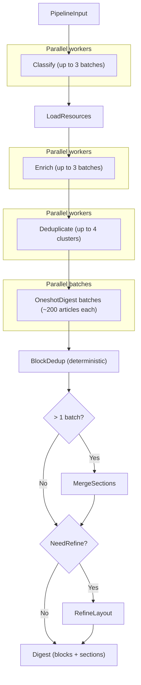

# Recap Pipeline

Developer specification for the daily recap pipeline.
This document describes the runtime behaviour implemented in
`src/news_recap/recap/flow.py` and its task modules.

> Instead of throwing raw headlines into one oversized prompt, `news-recap`
> processes news through a layered recap workflow that reduces noise, groups related stories,
> and produces a cleaner daily digest.

## Pipeline overview


```mermaid
flowchart TD
    subgraph parallel1 [Parallel workers]
        classifyW["Classify (up to 3 batches)"]
    end
    subgraph parallel2 [Parallel workers]
        enrichW["Enrich (up to 3 batches)"]
    end
    subgraph parallel3 [Parallel workers]
        dedupW["Deduplicate (up to 4 clusters)"]
    end
    subgraph oneshotBatches [Parallel batches]
        oneshotW["OneshotDigest batches (~200 articles each)"]
    end

    inp[PipelineInput] --> classifyW
    classifyW --> loadRes[LoadResources]
    loadRes --> enrichW
    enrichW --> dedupW
    dedupW --> oneshotW
    oneshotW --> blockDedup["BlockDedup (deterministic)"]
    blockDedup --> merge{"> 1 batch?"}
    merge -->|Yes| mergeSec[MergeSections]
    merge -->|No| needRefine{"NeedRefine?"}
    mergeSec --> needRefine
    needRefine -->|Yes| refineLayout["RefineLayout"]
    needRefine -->|No| done["Digest (blocks + sections)"]
    refineLayout --> done
```

The flow `recap_flow` runs steps in fixed order (8 steps):

1. **Classify** — classify articles as `ok / vague / exclude`, in LLM batches or, when turned
   on, with [Jev](#jev).
2. **LoadResources** — download full-text for articles needing enrichment.
3. **Enrich** — rewrite headlines and extract excerpts via LLM agents.
4. **Deduplicate** — merge articles that cover one news story (embedding pre-filter, then LLM
   clustering or, when turned on, Jev pair decisions plus one LLM launch for the merged headlines).
5. **OneshotDigest** — articles split into batches of ~200, processed in parallel; each batch agent groups and titles blocks and sections in one pass.
6. **BlockDedup** *(deterministic, no LLM)* — removes exact-duplicate, subset, and semantically similar blocks.
7. **MergeSections** *(only when > 1 batch)* — reconciles section names from all batches into a unified section list.
8. **RefineLayout** *(optional, gated)* — a single LLM call that absorbs small (1–2 block) sections into semantically fitting larger sections; sections with 3+ blocks are left untouched. Skipped when all sections already have ≥ 3 blocks.

Steps 1, 3, 4, and 5 run up to `_MAX_PARALLEL` concurrent workers.
Steps 2, 6–8 are single-threaded.

### Jev

TypeSafe's Jev answers yes/no questions about a piece of text with a probability, at \$0.042 per
million input tokens (output is free), but it cannot write text. It takes over the per-article
*decisions* of Classify and Deduplicate, where it was measured against the LLM
([Experiments](#jev-decisions)); every step that writes text stays on the LLM.

- **Opt-in per step**, classify and deduplicate separately. Both default to the LLM, so a fresh
  install runs with no keys on the free agy tier ([settings](settings.md)). Without a key at run
  time the step uses the LLM.
- **Pinned model** (`jev-1.13.0`): the thresholds are tuned against it, so an upgrade means
  rerunning the bench first.
- **Called through `typesafe-sdk`**, not the `jev` wrapper, which needs Python ≥ 3.14 and
  discards the probabilities the thresholds need.
- **A Jev failure** (after the SDK's own retries) or a missing answer sends the whole step to its
  LLM path for that night, with a warning in the log. Billed tokens are recorded either way.
- **A resumed night keeps the backends it started with.**
- **The key never reaches the agents**: they read untrusted news text with their permission
  checks off.
- Requests run 16 at a time against a documented limit of 80 per second (61 measured).
- Questions are in English. Jev handles other languages less well; it shows as the language bias
  in the [classify bench](#classify-bench).
- Each Jev step is its own row in the stage table, with tokens and cost, and keeps its
  per-article probabilities in the night's workdir. Run history records Jev's tokens and cost
  apart from the agents' tokens.

## Per-step contracts

### Classify

| | |
|---|---|
| **Module** | `recap/tasks/classify.py` |
| **Task type** | `recap_classify` |
| **LLM I/O** | Inline prompt with numbered headlines; agent prints verdicts to stdout |
| **Reads** | `ctx.inp.articles`, `ctx.inp.preferences` |
| **Writes state** | `kept_entries` — `list[ArticleIndexEntry]` (articles with verdict `ok` or `vague`) |
| | `enrich_ids` — `list[str]` (article IDs with verdict `vague`, routed to LoadResources/Enrich) |
| **Writes digest** | `articles[].verdict` |

Headlines are numbered 1..N in the prompt. The agent prints one line per
headline: `NUMBER: VERDICT`. Verdicts: `ok`, `vague`, `exclude`.

- `ok` — article is kept as-is; added to `kept_entries`.
- `vague` — headline is too vague to understand without reading the article; kept in `kept_entries` and added to `enrich_ids` so LoadResources fetches the full text and Enrich rewrites the headline.
- `exclude` — article is dropped entirely.

Batching: articles are split into batches of 50–300, up to 3 parallel
workers. A char-budget check prevents prompts from exceeding 60 000 chars.
Recognition rate below 80% raises `RecapPipelineError`. Batch success rate
below 80% also raises.

Batch sizes here and in enrich are tuned ceilings, not budgets to fill: past them the model
silently drops or miscounts items, the recognition guard fails the batch and it reruns whole,
so larger batches do not save launches.

#### Classify on Jev

One yes/no question per topic of the exclude policy, plus one for vague headlines. The policy is
split on line breaks and on commas outside parentheses, and an exception in parentheses applies
("sports (except Russia)"); topics are read literally, so they should name subjects. Each topic
question tells Jev to judge by what the story is about, not by the country or language of the
outlet. Jev sees the headline, the source and the first 300 characters of text.

An article is `exclude` when any topic reaches 0.75, else `vague` when the vague question reaches
0.65, else `ok`. 0.75 has the fewest wrong excludes among the best exclude/keep totals, since a
wrongly excluded story is never seen; 0.65 is mid-plateau for vague and rewrites fewer headlines
than 0.60.

Every article gets an answer or the step falls back, so the recognition guards do not apply.
About 785 tokens per headline, ≈ \$0.48/month. Fallback rate on nightly runs: not yet measured
(issue #19).

### LoadResources

| | |
|---|---|
| **Module** | `recap/tasks/load_resources.py` |
| **Task type** | *(no LLM — HTTP fetch)* |
| **Reads state** | `enrich_ids` |
| **Writes state** | `enrich_ids` — filtered to only successfully loaded articles |
| **Writes digest** | `articles[].resource_loaded`, `articles[].verdict` (reset to `ok` on failure) |

Downloads full-text for `vague` articles via `load_resource_texts` and caches
it under the pipeline directory. Articles that fail to load (or have no URL)
get their verdict reset to `ok` — they remain in the digest with their
original headline but won't be enriched. A failure rate above 30% is logged
as a warning and the pipeline continues: a failed download costs only that
headline's rewrite, while failing the run on it would have lost 3 of 32
nights in September–October 2026.

### Enrich

| | |
|---|---|
| **Module** | `recap/tasks/enrich.py` |
| **Task type** | `recap_enrich` |
| **LLM I/O** | Inline prompt with article texts; agent prints new headlines to stdout |
| **Reads state** | `enrich_ids` |
| **Writes state** | `enriched_articles` — `dict[article_id, str]` (article_id → new headline) |
| **Writes digest** | `articles[].enriched_title` |

Articles are embedded directly in the prompt, separated by `===ARTICLE===`.
Each article block contains: number, headline, blank line, body text
(truncated to 5 000 chars). The agent prints new headlines to stdout:
number on one line, headline on the next, then a blank line.

Batching: char-budget based — each batch stays within 60 000 chars of
article text and at most 20 articles, up to 3 parallel workers.
Recognition rate below 50% raises `RecapPipelineError`. Unprocessed
articles are retried for up to 3 rounds. If a round makes no progress the
loop stops early. Partial results are persisted; `fully_completed` is set
to `False` so the step re-runs on the next pipeline invocation.

### Deduplicate

| | |
|---|---|
| **Module** | `recap/tasks/deduplicate.py` |
| **Task type** | `recap_dedup` |
| **LLM I/O** | Per-cluster prompt with numbered articles; agent prints `MERGED:` / `SINGLE:` lines |
| **Reads** | `ctx.digest.articles` (all articles after Enrich) |
| **Writes digest** | Removes duplicate `DigestArticle` entries; sets `enriched_title` on the keeper |

Two-phase process:

1. **Embedding pre-filter** — sentence-transformer embeddings are computed for
   all articles and grouped by cosine similarity above `dedup_threshold`
   (default 0.90). Groups below size 2 are skipped.
2. **LLM clustering** — each similarity group is sent to an LLM agent that
   prints one of two line types per article:

```
MERGED: <merged headline>
<comma-separated article numbers>

SINGLE: <number>
```

`MERGED` actions keep the article with the most `clean_text`, set its
`enriched_title` to the merged headline, and add the other URLs to
`alt_urls`. Removed article IDs are also pruned from `ctx.state["kept_entries"]`.

Up to 4 clusters run in parallel. Partial failures are tolerated:
a warning is logged, but the phase is marked complete and the pipeline
continues (dedup is best-effort).

**One story.** A news item and the reactions, statements, denials,
assessments, analyses, explainers and interviews about it are one story and
become one digest entry. Separate events (even about the same people or
place), a statement on a different subject, and roundups covering several
stories (Reuters' "World News" videos) stay apart. Both paths are measured
against this rule; the LLM prompt asks for "the same piece of news" and leaves
about twice as many pieces of one story apart as Jev
([bench](#deduplicate-bench)).

#### Deduplicate on Jev

The embedding pre-filter is the same; the LLM launches over the clusters are
replaced by:

1. **Pair decisions.** For every pair inside each candidate group, Jev answers
   whether the two are one story under the rule above. It sees only the two
   headlines (Enrich's rewrite where there is one); adding the source and lead
   scored worse. A pair merges at ≥ 0.60.
2. **Wider net.** Pairs at embedding similarity 0.87–0.90 that no candidate
   group holds are asked too. Translations and paraphrases of one report fall
   there (Starship's first orbit in Serbian and in English, the Vučić → Brnabić
   handover reports), and the LLM path never sees them. They merge at ≥ 0.70,
   since below the pre-filter pairs are more often different stories. The net
   grows with the square of the night's size, so a night is capped at its
   5 000 most similar such pairs (≈ 80 s, ≈ \$0.10).
3. **Groups.** "Same" pairs are joined into connected components and
   star-grouped inside: the keeper is the article with the longest text, and
   an article joins a group only if it matches the keeper, so A≈B and B≈C do
   not put C with A.
4. **Merged headlines.** One LLM launch (the dedup task's model) writes a
   headline for every merge group under the LLM path's rules: the key facts of
   every member, a separate statement or reaction included; not much longer
   than the longest original; in the output language. Keeping one member's
   title would hide the other story whenever a merge is wrong; the written
   headline states it.
5. **No headline, no merge.** A group the launch leaves without a headline —
   or every group, if the launch fails — stays unmerged: a duplicate left
   visible is a lesser harm than a hidden story.

As on the LLM path, a candidate group above 20 articles is split into chunks,
and pairs across chunks are never asked (5–8 pairs a night).

One agy launch a night (≈ 26–33k tokens) instead of 3–6; Jev ≈ 1 200 pair
requests on a 450-article night, ≈ \$0.74/month.

### OneshotDigest

| | |
|---|---|
| **Module** | `recap/tasks/oneshot_digest.py` |
| **Task type** | `recap_oneshot_digest` |
| **LLM I/O** | Articles split into batches; each batch agent prints `SECTION:` / `BLOCK:` / `ARTICLES:` / `EXCLUDED:` lines; a merge agent reconciles section names |
| **Reads** | `ctx.digest.articles` |
| **Writes digest** | `blocks` — `list[DigestBlock]`, `recaps` — `list[DigestSection]` |

Articles are pre-sorted by embedding similarity, then split into batches of
`_BATCH_SIZE` (default 200). Each batch is processed by a parallel `recap_oneshot_digest`
agent. After all batches complete, a deterministic block dedup pass runs
(see Block Dedup below). When more than one batch is used, a follow-up
`recap_merge_sections` call receives only the section names from all batches
and produces the final consolidated section list (see MergeSections below).

Coverage below 50% of non-excluded articles raises `RecapPipelineError`.

Per-batch output format:

```
SECTION: <section title>
SECTION_SUMMARY: <1-2 sentences>
BLOCK: <block title>
SUMMARY: <2-4 sentences>
ARTICLES: <comma-separated numbers>

EXCLUDED: <comma-separated numbers>
```

### Block Dedup

| | |
|---|---|
| **Module** | `recap/tasks/oneshot_digest.py` (`_dedup_blocks`) |
| **Task type** | *(no LLM — deterministic set operations)* |
| **Invoked by** | `OneshotDigest` after all batch agents complete |

Removes redundant blocks in three phases:

1. **Exact-duplicate removal** — blocks whose `article_ids` form the same
   set (order-insensitive) are grouped. The block with the longest title is
   kept; ties broken by earlier position.
2. **Subset absorption** — if block A's article-ID set is a strict subset
   of block B's, A is absorbed into B. When A is a subset of multiple
   supersets, the smallest superset wins (closest match). Chained subsets
   (A⊂B⊂C) are resolved transitively.
3. **Fuzzy title merge** — block titles are embedded via the same
   `SentenceTransformerEmbedder` already loaded for article pre-sorting.
   Blocks whose title embeddings have cosine similarity ≥ 0.90 are
   clustered (connected components via `group_similar`).  Within each
   cluster the block with the most articles wins (longest title, then
   earliest position as tiebreakers); `article_ids` from all cluster
   members are combined.  This catches cross-batch overlaps where two
   batches independently created blocks about the same story with
   different article sets — something Phases 1–2 cannot detect because
   they compare article-ID sets only.

After removal, all `DigestSection.block_indices` are remapped to the
compacted block list. Duplicate indices within a section are deduplicated
while preserving order. Sections that lose all blocks are dropped.

Phases 1–2 compensate for LLM non-determinism: the oneshot prompt
instructs that each article number must appear in exactly one block, but
in practice ~10% of articles end up in multiple blocks — producing
duplicate and subset blocks.  Phase 3 addresses a different issue: with
multiple batches, two LLM calls may independently group different
articles into blocks covering the same story.  All three phases run
without additional LLM calls.

### MergeSections

| | |
|---|---|
| **Module** | `recap/tasks/oneshot_digest.py` (internal to `OneshotDigest`) |
| **Task type** | `recap_merge_sections` |
| **LLM I/O** | Numbered section names from all batches; agent prints `SECTION:` / `SECTION_SUMMARY:` / `INCLUDES:` lines |
| **Invoked by** | `OneshotDigest` when article count exceeds one batch |

Receives only the section titles from all batches (not article content).
Groups related sections under a canonical name and writes a combined summary.

Output format:

```
SECTION: <canonical section name>
SECTION_SUMMARY: <one sentence combining coverage of the group>
INCLUDES: <comma-separated input section numbers>
```

Every input section number must appear in exactly one `INCLUDES` line.
A section that stands alone has only its own number in `INCLUDES`.

### RefineLayout

| | |
|---|---|
| **Module** | `recap/tasks/refine_layout.py` |
| **Task type** | `recap_refine_layout` |
| **LLM I/O** | Section titles + numbered block titles in prompt; agent prints `SECTION:` / `SECTION_SUMMARY:` / `BLOCKS:` lines |
| **Reads digest** | `blocks`, `recaps` |
| **Writes digest** | `recaps` — `list[DigestSection]` (rewritten; blocks untouched) |

Optional post-processing step that runs after OneshotDigest (including
BlockDedup and MergeSections).  Gated by `needs_refinement`: skipped when
all sections have ≥ 3 blocks.

Conservative refinement: relocates blocks from sections with 1–2 blocks
into semantically fitting larger sections.  Sections with 3+ blocks are
left untouched — no renaming, no block removal.  The prompt sends section
titles and numbered block titles (no article IDs or block summaries);
small sections are tagged `[SMALL]` in the input so the LLM knows which
sections are candidates for absorption.

Output format:

```
SECTION: <section title>
SECTION_SUMMARY: <one sentence>
BLOCKS: <comma-separated block numbers>
```

Validation: every block number (1..N) must appear exactly once across all
`BLOCKS` lines.  Up to 5% omitted blocks are tolerated (auto-appended to
the last section with a warning).  On invalid output (duplicates, >5%
missing, unparseable), the step falls back to the pre-refinement sections.

This is a separate checkpoint from OneshotDigest.  `restore_state()` is a
no-op (blocks and recaps are already in the checkpoint).

## State and checkpointing

Two layers of state flow through the pipeline:

| Layer | Storage | Scope |
|---|---|---|
| `FlowContext.state` | In-memory `dict` | Ephemeral — lost between pipeline invocations |
| `Digest` | `digest.json` in pipeline dir | Persistent — survives restarts |

After each step, `ctx.save_checkpoint()` serializes the `Digest` to
`digest.json`. On the next invocation, if a checkpoint exists, the flow
resumes from it.

### Phase skipping

`Digest.completed_phases` is a list of step names. When `TaskLauncher.run()`
sees the step name already present it skips execution and calls
`restore_state()` instead — this method reconstructs the `ctx.state` entries
that downstream steps depend on, reading from the persisted `Digest`.

If a step sets `fully_completed = False` (partial results), its name is
*not* added to `completed_phases`, so it re-runs on the next invocation.

### Early stopping

`stop_after` (set via argument or `NEWS_RECAP_STOP_AFTER` env var) halts
the pipeline after the named step completes by raising `StopPipelineError`.
The flow catches this and marks the run as completed.

Valid `stop_after` values: `classify`, `load_resources`, `enrich`,
`deduplicate`, `oneshot_digest`, `refine_layout`.

### Failure

A failed pipeline makes `create` print "Pipeline failed" and exit with code 1,
so the scheduled job's log ends with `RESULT: FAILED`.

## Output shape

The final digest contains:

```
Digest
  digest_id: str
  run_date: str
  status: str
  articles: list[DigestArticle]
  blocks: list[DigestBlock]
  recaps: list[DigestSection]
  day_summary: str
  completed_phases: list[str]
```

Each `DigestBlock` has:

- `title` — short topic label.
- `summary` — 2-4 sentence prose describing what happened.
- `article_ids` — references to `DigestArticle.article_id` entries.

Each `DigestSection` has:

- `title` — short section label.
- `summary` — 1-2 sentence overview of the section topic.
- `block_indices` — zero-based indices into `blocks`.

There is no event layer; blocks reference articles directly.

## Cost

### agy (default agent)

The free Antigravity tier is quota-limited, and the quota is the binding
constraint: from 2026-09-04 to 10-05, 6 of 32 nightly runs were lost to agy
lockouts (one daily, three weekly). agy reports only "Individual quota
reached", and the launch count alone does not predict it: one night hit the
daily cap at its 11th launch while two others ran 17 launches without hitting
it; the two fully observed weekly windows locked out after 56 and 64 launches.
Each launch is a multi-turn agent session that spends about 13k input tokens
before reading the prompt.

Night 2026-10-06, 412 kept articles, every step on the LLM:

| Step | Launches | Tokens |
|---|---|---|
| classify | 3 | 126,718 |
| deduplicate | 6 | 157,484 |
| enrich | 3 | 123,312 |
| oneshot_digest | 3 | 170,614 |
| merge_sections | 1 | 17,869 |
| refine_layout | 1 | 33,008 |
| total | 17 | 629,005 |

A median completed night takes 12 launches (classify 3, enrich 1,
deduplicate 4, oneshot_digest 2, merge_sections 1, refine_layout 1).

With classify on Jev the 10-06 night takes 14 launches / ≈ 515k tokens,
counting ≈ 13k more enrich tokens for the extra vague headlines Jev finds;
with deduplicate on Jev as well, 9 / ≈ 391k, counting the merged-headlines
launch. On the median night: 12 → 9 → 6 launches.

### Jev

Classify ≈ \$0.48/month; deduplicate ≈ \$0.74/month (scaled from the
bench's pair counts, not a live run). The questions dominate a request's
tokens: a headline-only classify request still costs 91% of a full one.

### Subscriptions

With codex or claude, each digest run consumes roughly 3–4% of the weekly
subscription quota (~\$0.19 per run). At daily use this adds up to ~20% of
the weekly limit, or ~\$6/month in equivalent dollar terms. The dollar
figures are approximate: under a flat-rate subscription (~\$20/month) the
quota would mostly go unused anyway, so the pipeline effectively runs for
free within it.

### API mode

An API-key mode (`--api`) is available using Haiku for most tasks and
Sonnet for the oneshot digest.  It is faster per-token but adds up to
~\$13/month at daily use.  API mode is mainly useful for environments
where CLI agents are not available.

## Experiments

### Pipeline tuning

Run on one 703-article corpus (25 Mar 2026) using Claude CLI agents under a
\$20/month subscription.

Before settling on the current pipeline, an alternative **map-reduce**
approach was evaluated.  It used five LLM stages after Deduplicate:

1. **MapBlocks** — split headlines into chunks of ~300 and group each chunk
   into titled blocks in parallel.
2. **ReduceBlocks** — merge overlapping block titles from all map workers
   into a unified list; mark overly broad blocks as SPLIT.
3. **SplitBlocks** — break SPLIT-marked blocks into smaller thematic
   sub-blocks (parallel workers).
4. **GroupSections** — cluster the flat block list into reader-facing
   sections with short topic labels.
5. **Summarize** — produce a heading + bulleted day summary from the
   section structure.

| | Map-reduce | Oneshot (no refine) | Oneshot + RefineLayout |
|---|---|---|---|
| Time | 26 min | 5–7 min | 6–8 min |
| Blocks | 158 | 239 | 182 |
| Sections | 24 | 33 | 27 |
| Sections ≤ 2 blocks | 0 | 8 | 3 |
| Max section size | 14 | 25 | 18 |
| Avg section size | 6.6 | 7.4 | 7.1 |
| Article coverage | 100% | 98% | 97% |
| Day summary | yes (global) | per-section only | per-section only |
| Sub. cost / run | ~\$0.23 (5% weekly) | ~\$0.16 (3.5%) | ~\$0.19 (4%) |

**Map-reduce** produced the most compact output — the reduce step merged
overlapping blocks across map shards, resulting in fewer, denser blocks.
Sections were well-separated.  Downsides: 4× slower, ~20% more expensive,
mixed-language section titles in some runs, and no per-section summaries.

**Oneshot without refine** is the fastest option.  Articles are pre-sorted
by embedding similarity and split into batches of ~200, processed in
parallel.  Deterministic block dedup (exact + subset + fuzzy title merge)
removes redundant blocks.  Main weakness: 8–12 orphan sections with 1–2
blocks that fragment the reading experience.

**Oneshot + RefineLayout** adds one lightweight LLM call after block dedup
and section merge.  Conservative refinement: the LLM is constrained to
only absorb `[SMALL]` (1–2 block) sections into existing larger sections
where the thematic fit is clear.  Sections with 3+ blocks are untouched.
Result: 33 → 27 sections, 3 remaining small sections (none has a clear
larger home), max section size 18, average 7.1.

The best qualities of the map-reduce approach (semantic block merging) were
incorporated into the oneshot pipeline as the fuzzy title merge phase of
BlockDedup, making the five extra LLM stages unnecessary.  The map-reduce
code was removed.

### Jev decisions

`scripts/bench_jev.py` replays archived nights (2026-09-29, 09-30, 10-01 and
10-06 for tuning; 10-04 is the holdout, run once after the thresholds were
chosen). Today's LLM decisions (agy `gemini-3.7-flash --effort low`) are
replayed from the archived workdirs, so both are scored on the same items.
The rows the conclusions below rely on are in `bench/`; its README names the
claim each file supports.

- **Ground truth** is labels made blind by Claude (Opus 5.5) at the user's
  request, under written rules the user confirmed. Every disagreement between
  Jev and the LLM in a scored configuration is labelled; an unlabelled
  agreement counts as correct (59 of 60 sampled classify agreements were).
- **Gate:** the reader-visible errors a step can cause (wrong excludes, wrong
  merges) must not increase and its correct decisions must not decrease, on
  the tuning nights and on the holdout separately. A wrongly excluded story
  counts as worse than a wrongly kept one, since the reader never sees it, so
  wrong excludes are gated on their own.
- **No LLM judge:** a Sonnet judge agreed with the classify labels only 74.3%
  (it reads "vague" narrowly), so the gates use labels directly.

#### Classify bench

Labelling rules: *exclude* when the story's subject (not the outlet's
language) is Croatian domestic affairs, non-Russian sports, health or wellness
advice to the reader (symptoms, diet, sleep, anxiety tips), horoscopes or the
Epstein files; health research news and local notices caused by a sports event
are kept. *Vague* when the headline withholds the fact it is about (an unnamed
entity — "a famous singer", "this setting", "33 things"; a teaser question; a
puzzle or show title); guide questions ("Is X worth buying?") and deal posts
are ok. 348 labels.

| exclude ≥ 0.75, vague ≥ 0.65 | wrong excludes (Jev / LLM) | missed excludes | correct exclude/keep | vague F1 |
|---|---|---|---|---|
| tuning, 3 nights, 1 459 headlines | 4 / 13 | 6 / 12 | 1 449 / 1 434 | 0.526 / 0.525 |
| holdout, 277 headlines | 0 / 0 | 4 / 6 | 273 / 271 | 0.629 / 0.629 |

- Exclude improves; vague only ties the LLM, and both are weak at it. Jev
  calls more headlines vague (113 vs 98 on four nights), and Enrich rewrites
  each (≈ 3.2k agy tokens): about 13k of the 127k classify saving on an
  average night.
- Exclude threshold on the tuning nights: 0.65 → 27 wrong / 2 missed,
  0.70 → 7 / 5, 0.75 → 4 / 6, 0.80 → 3 / 10. Jev's wrong excludes are mostly
  Croatian-language stories not about Croatia (44 of 50 at 0.60): it leans on
  the outlet's language despite the instruction, and the higher threshold
  removes most of them.
- Asking about vague on the headline alone reaches F1 0.56 but doubles the
  tokens; not adopted.

#### Section routing bench (rejected)

Placing articles into fixed sections on Jev before writing — one yes/no
question per follow topic plus one choice over six general sections, with the
URL in what Jev sees, since many Serbian outlets carry no text — would save
51k more agy tokens a night than deduplicate on Jev, and it agrees with
today's digests on follow topics (Serbia 365 of 366). It was rejected because
it splits 20.7% of today's multi-article blocks across sections (21.9% on the
holdout; the gate was ≤ 10%). Most splits separate stories the LLM bundled by
theme, but 11 of 259 blocks put one news event in two sections: about three
stories a night shown twice.

- Grouping by embedding clusters before routing does not help: with the
  pipeline's embedder, components at 0.65–0.80 swallow the whole night and at
  0.90 they chain unrelated stories (split rate 22.5%).
- One choice over all sections, follow topics included, is worse (30.8%): its
  probabilities are exclusive and peaked, so a follow topic loses to a general
  section that also fits.

#### Deduplicate bench

Under the one-story rule, inside today's candidate groups, Jev merging at
≥ 0.60 (448 labelled pairs):

| | wrong merges (Jev / LLM) | missed same-story pairs | correct pairs |
|---|---|---|---|
| tuning, 4 nights, 1 569 pairs | 14 / 8 | 53 / 108 | 1 502 / 1 453 |
| holdout, 85 pairs | 0 / 0 | 0 / 7 | 85 / 78 |

- No threshold beats the LLM on both wrong merges and correct pairs
  (0.55 / 0.60 / 0.65: 17 / 14 / 12 wrong, 48 / 53 / 59 missed), so the pair
  gate fails; the LLM in turn leaves twice as many pieces of one story apart.
  7 of Jev's 14 wrong merges are Reuters roundup videos, which the LLM merges
  too: neither sees more than the headline.
- In articles, with the wider net: on the tuning nights Jev removes 204
  duplicates and folds in 9 different stories, the LLM 147 and 2; on the
  holdout 22 and 0, the LLM 9 and 0.
- Wider net: 76 of its 79 merges on the tuning nights are one story, 8 of 9 on
  the holdout. Under the stricter rule below, the 0.85–0.87 band took 74% of
  the net's requests for 22 of its 47 correct merges, so the net starts at
  0.87; and without the net Jev removed fewer true duplicates than the LLM
  (123 vs 132).
- The question: "the same specific news event" merged separate statements
  about one story and split one incident reported at different moments. The
  shipped question asks whether a digest should show the two as one item, with
  yes/no criteria stating the rule. The headline alone beats headline, source
  and lead.
- A stricter rule, where a reaction is a separate story, was measured too:
  with the matching question, Jev made fewer wrong merges than the LLM (13 vs
  31; holdout 1 vs 2) but missed more duplicates (25 vs 8). The committed rows
  keep both labels.
- The numbers are in-sample: the question, the rule and both thresholds were
  chosen on the tuning nights' labels, and the holdout is too small to
  separate the two.
- Live, on a copy of night 10-06 (real embedder and Jev, no agy, the 0.85 band
  and the stricter question): 452 articles → 410 (the LLM removed 40 that
  night), 3 576 pair requests, 1.72M tokens, \$0.072, 72 s. The bench builds
  the wider net from the archived original titles, production from the
  rewritten headlines, so the bench sees fewer wider pairs (2 688 vs 3 187 on
  10-06); cost figures come from the live run.

#### Merged headlines bench

One agy launch per tuning night on the merge groups Jev made (0.85 band,
stricter rule): 123 groups, every one headlined, all in the output language,
median length 1.16 × the longest original. Of the 9 members that were a
different story from their keeper, 8 are stated in the written headline
("OpenAI expanded ChatGPT with apps, automation and an office suite"); one,
an opinion piece on an AI Greta Garbo advert, is lost. The LLM path loses one
story in its 16 wrongly merged groups (a "Spaniards welcome snap election"
reaction). 25.8–33.0k tokens per launch, ≈ 20 s.

Not measured: headlines for the larger groups the one-story rule makes, and
the holdout night.
